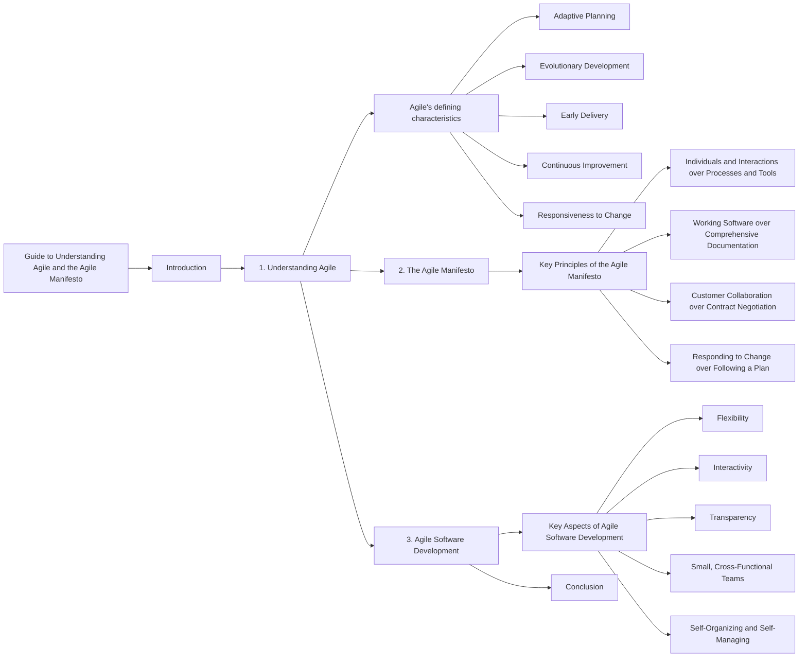

# What-is-Agile

1️⃣  Value #1: Individuals and interactions

Successful teams prioritize finding the right people and making sure they communicate frequently. Good tools and processes help, but focusing on the individuals and their interactions will yield the best results.

For example, the world's best guitar is useless to someone that doesn't know how to play it. Making a beautiful song (or product) requires highly skilled people that can collaborate effectively.

Your team should do the same: prioritize people and communicate often. Frequent discussions across the team help uncover critical information to keep the work moving forward.

---

2️⃣  Value #2: Working software

Successful teams prioritize delivering a product that works. Not to make it perfect. This value applies to any work you deliver to customers, not just software.

Before agile, teams would try to build against the full scope of project requirements, allowing very little flexibility.

Instead, your team should look for a few critical features to deliver as a  Minimum Viable Product  (or MVP). Then, the team should prioritize building the MVP and get it in the customers' hands as quickly as possible.

This practice gives customers a working product. And it allows your team to get real-time feedback to improve future iterations.

---

3️⃣   Value #3: Customer collaboration

Successful teams prioritize frequent collaboration with stakeholders and customers. Think of your customers as partners, working closely to design the best solution.

Before agile, teams would spend a lot of time detailing a final product before the work started. The problem was that these original details rarely ended up providing much value in the end.

Instead, you should partner closely with your customer throughout the process and be ready to adapt to changing needs and requirements. Gather feedback frequently to help your customers quickly solve their highest priority problems.

---

4️⃣  Value #4: Responding to change

Successful teams stay flexible and ready to adapt to unforeseen changes. Starting with a plan is always a good idea. But don't be overly rigid in sticking to it.

It's important to recognize in work (and life) that change is the only constant. Markets, teams, projects, and situations are constantly in flux. 

You and your team will be most successful if you prepare your mind for constant changes, and be ready to make intelligent pivots on a whim.

---

Our highest priority is to satisfy the customer through early and continuous delivery of valuable software.
Welcome changing requirements, even late in development. Agile processes harness change for the customer's competitive advantage.
Deliver working software frequently, from a couple of weeks to a couple of months, with a preference to the shorter timescale.
Business people and developers must work together daily throughout the project.
Build projects around motivated individuals. Give them the environment and support they need, and trust them to get the job done.
The most efficient and effective method of conveying information to and within a development team is face-to-face conversation.
Working software is the primary measure of progress.
Agile processes promote sustainable development. The sponsors, developers, and users should be able to maintain a constant pace indefinitely.
Continuous attention to technical excellence and good design enhances agility.
Simplicity--the art of maximizing the amount of work not done--is essential.
The best architectures, requirements, and designs emerge from self-organizing teams.
At regular intervals, the team reflects on how to become more effective, then tunes and adjusts its behavior accordingly.

---

✅   1.  Show respect for all team members

Healthy, high-performing teams create a culture of trust and mutual respect. That's the backbone of agility. 

Having an agile mindset means you embrace different ways of thinking and working, even if you don't always agree with them. Focus on keeping an open mind and seeking to understand new and unexpected ideas.

✅   2.  Communicate openly and clearly

Share updates. Ask questions. Be open and transparent at all times. With each interaction, challenge yourself to communicate clearly and concisely. 

Encourage your team to engage in frequent discussions. Quality discussions can reveal critical information that moves the work forward and helps the team feel more connected.

✅  3.  Look for ways to innovate

Agility is all about delivering maximum value to customers. When a customer's needs change, you need to respond quickly with an innovative solution.

Having an agile mindset means you're constantly looking for opportunities to innovate. This could mean improving your team's internal processes. Or enhancing features of the product you're building.

As you complete your daily tasks, think if there are ways to improve what you're doing. Analyzing and improving your team's work will be valuable for your future career.

✅   4.  Actively improve your skills

Agile is all about continuous improvement. In your daily work, always look for opportunities to learn and grow your skillset.

Pause for a minute and think about your current skills: Which skills seem to be most valuable? Which skills mesh well with your natural tendencies? Use these questions as a starting point to help you plan which skills to sharpen.

Prioritizing your skill development is always a good idea. Not only does it help your team, but it also improves your future career opportunities.

✅   5.  Your work doesn't have to be perfect

Your goal is to deliver something that works; an MVP. Not to make every detail perfect.

Shift your mindset to focus on doing "good enough" work, and then get immediate feedback to improve the next version. Try to adopt this approach for both large and small tasks.

"Good enough" is different for every team and every project. If the parameters are not clear, you may want to discuss them with your team leader.

✅   6.  Have a plan, but always be ready to pivot

An agile mindset is about being flexible and ready for any unpredictable change. Yes, you should always have a Plan A (and B and C, if time allows). But you'll be most successful at work if your mind is always prepared to pivot.

Change will come. It always does. Your job is to prepare your brain to stay calm and collected so that you can handle each emotional wave with ease. If everyone on the team is ready for change, you'll be able to bounce back quickly and refocus energy on solving new problems.

---

# Guide to Understanding Agile and the Agile Manifesto

## Introduction
Agile is an iterative approach to project management that focuses on responsiveness and delivering value quickly to customers. This guide will provide an overview of Agile, its defining characteristics, and explain the philosophy behind the Agile Manifesto.

## 1. Understanding Agile
Agile is an iterative project management approach that emphasizes small increments of work and continuous feedback from customers. Unlike traditional planning methods, Agile allows for adaptive planning and evolving development.

- Agile's defining characteristics:
  - Adaptive Planning: Rather than planning an entire year's worth of work, Agile focuses on planning small iterations to deliver value and receive feedback from customers.
  - Evolutionary Development: Agile promotes building software in small increments and evolving it over time based on customer feedback.
  - Early Delivery: Agile emphasizes the importance of delivering iterations to customers early to obtain valuable feedback for improvement.
  - Continuous Improvement: Agile enables teams to continuously improve both their work processes and the product by incorporating customer feedback.
  - Responsiveness to Change: Agile allows teams to respond quickly to changing requirements and adapt their plans based on customer needs.

## 2. The Agile Manifesto
The Agile Manifesto is a set of principles that guide Agile software development. It values certain aspects more than others to ensure customer satisfaction and flexibility throughout the development process.

- Key Principles of the Agile Manifesto:
  - Individuals and Interactions over Processes and Tools: Prioritizing effective communication and collaboration among team members and with customers rather than relying solely on processes and tools.
  - Working Software over Comprehensive Documentation: Placing more importance on delivering functional software rather than extensive documentation.
  - Customer Collaboration over Contract Negotiation: Emphasizing the collaboration and active involvement of customers in the development process, instead of focusing solely on contractual agreements.
  - Responding to Change over Following a Plan: Valuing the ability to respond and adapt to changing requirements instead of strictly adhering to a predefined plan.

## 3. Agile Software Development
Agile software development aligns with the principles of the Agile Manifesto. It emphasizes keeping the core values in mind while focusing on flexibility, interactivity, and transparency.

- Key Aspects of Agile Software Development:
  - Flexibility: Agile teams embrace change and adapt their plans and development process accordingly.
  - Interactivity: Effective communication and collaboration among team members and customers are crucial for successful Agile development.
  - Transparency: Agile teams promote transparency by ensuring that everyone knows what others are working on and fostering a sense of responsibility towards delivering value to customers.
  - Small, Cross-Functional Teams: Agile teams are composed of small, co-located, cross-functional members who work together to achieve project goals.
  - Self-Organizing and Self-Managing: Agile teams have autonomy and take ownership of their work, organizing themselves to maximize productivity and efficiency.

## Conclusion
Agile is an iterative and collaborative approach to software development that values customer satisfaction and flexibility. The Agile Manifesto outlines the core principles that guide Agile development, emphasizing the importance of individuals, working software, customer collaboration, and responsiveness to change. By implementing Agile methodologies and embracing its core values, teams can deliver high-quality software that meets evolving customer needs.

# Guide to Waterfall, Extreme Programming, and Kanban in Software Development

## Introduction
In software development, different approaches and methodologies are used to manage projects and deliver high-quality software. This guide explores the Waterfall approach, the Extreme Programming (XP) approach, and the Kanban methodology. We will discuss the problems with the Waterfall approach, explain the principles and values of XP, and define Kanban along with its core principles.

## 1. Waterfall Approach
The Waterfall approach is a traditional, sequential method of software development that follows a linear progression from one phase to another. Here is a breakdown of the typical Waterfall process:

1. Requirements Phase: Gathering and documenting all the customer's requirements for the system.
2. Design Phase: Creating a detailed design based on the gathered requirements.
3. Coding Phase: Writing the actual code based on the design.
4. Integration Phase: Combining the separate modules or components to form a working system.
5. Testing Phase: Evaluating the system to identify and fix any bugs or issues.
6. Deployment Phase: Releasing the software to the production environment.

### Problems with the Waterfall Approach:
- Lack of Change Provision: The Waterfall approach has no provision for accommodating changes once a phase is completed, leading to inflexibility.
- Limited Feedback and Delivery: Intermediate deliverables are not provided until the final deployment phase, making it difficult to assess progress and gather feedback from customers.
- Information Loss and Blocking: Passing work from one phase to another increases the risk of losing information and creating bottlenecks if the subsequent phase cannot accept the work.
- Costly Mistake Corrections: Discovering mistakes or design flaws late in the process can be expensive and time-consuming to rectify.
- Long Lead Times: The entire development process, from initial requirements to deployment, can have lengthy lead times, resulting in delayed software delivery.

## 2. Extreme Programming (XP) Approach
Extreme Programming (XP) is an Agile software development methodology introduced in 1996 by Kent Beck. It is an iterative approach that emphasizes frequent feedback, collaboration, and responsiveness to change. The key values of XP are:

1. Simplicity: Delivering only what is necessary and avoiding unnecessary complexity.
2. Communication: Encouraging open and frequent communication among team members.
3. Feedback: Establishing feedback loops to continuously assess progress and make improvements.
4. Respect: Valuing each team member's opinions, expertise, and contributions.
5. Courage: Being honest about capabilities and commitments, and embracing change when necessary.

XP operates within short iterations or cycles, with a focus on continuous improvement, customer involvement, and delivering high-quality software incrementally.

## 3. Kanban Methodology
Kanban is a visual and lean methodology derived from the Japanese manufacturing system. It promotes a continuous flow of work and emphasizes efficiency and productivity. The core principles of Kanban are:

1. Visualize the Workflow: Creating a visual representation of the work process to enhance understanding and transparency.
2. Limit Work in Progress (WIP): Restricting the number of tasks or items in progress at any given time to prevent bottlenecks and improve flow.
3. Manage and Enhance Flow: Analyzing and optimizing the workflow to improve efficiency and reduce lead times.
4. Make Policies Explicit: Defining clear guidelines and rules for how work is done and what constitutes completion.
5. Continuously Improve: Encouraging regular reflection, feedback, and adaptation to drive ongoing improvement and innovation.

Kanban boards are often used to visualize work items, track progress, and facilitate collaboration within Agile teams.

## Conclusion
Understanding different software development approaches is essential for selecting the most suitable methodology for a given project. The Waterfall approach, although structured, can lead to

 inflexibility, delayed feedback, and costly corrections. On the other hand, Extreme Programming (XP) emphasizes iterative development, customer collaboration, and continuous improvement. Kanban, derived from lean manufacturing principles, focuses on visualizing workflow, limiting work in progress, and optimizing flow. Each approach offers unique advantages and can be adapted to various project requirements and team dynamics.

By incorporating Agile methodologies like XP and Kanban, software development teams can enhance collaboration, responsiveness, and overall project success."
